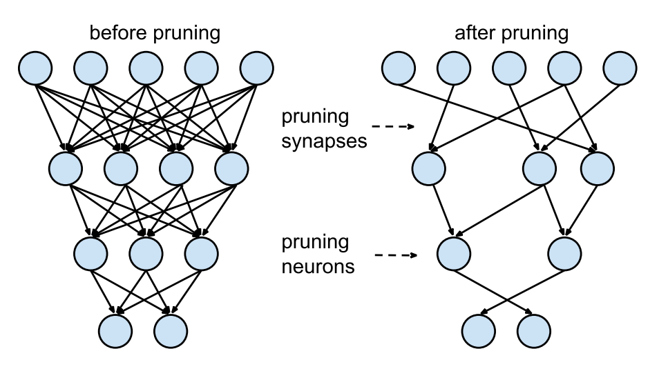
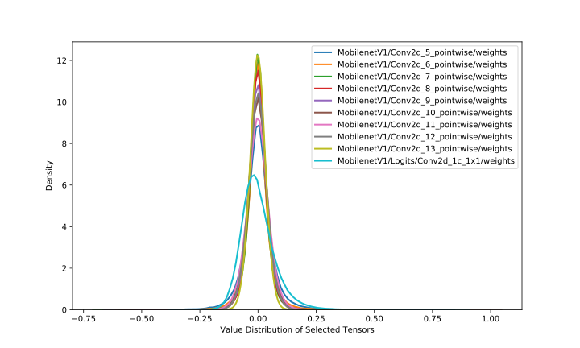
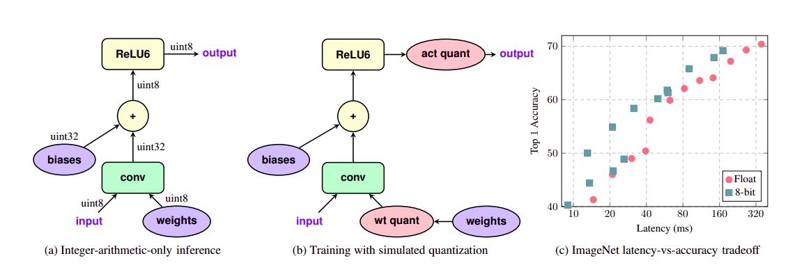

Machine Learning models are getting bigger and expensive to compute. Embedded
devices have restricted memory, computation power and battery. But we can
optimize our model to run smoothly on these devices. By reducing the size of the
model we decrease the number of operations that need to be done hence reducing
the computation. Smaller models also trivially translate into less memory usage.
Smaller models are also more power-efficient. One must think that a reduced
number of computations is responsible for less power consumption, but on the
contrary, the power draw from memory access is about 1000x more costly than
addition or multiplication. <!--more--> Now since there are no free lunches i.e.
everything comes at a cost, we lose some accuracy of our models here. Bear in
mind these speedups are not for training but inference only.

> [Part 2](/making-models-smaller-2) of the post can be found here.

## Pruning

<!--proof-read-->

Pruning is removing excess network connections that do not hugely contribute to
the output. Ideas of pruning networks are very old dating back to 1990s namely
[_Optimal Brain Damage_][obd] and [_Optimal Brain Surgeon_][obs]. These methods
use Hessians to determine the importance of connections, which also makes them
impractical to use with deep networks. Pruning methods use an iterative training
technique i.e. _Train $\Rightarrow$ Prune $\Rightarrow$ Fine-tune_. Fine-tuning
after pruning restores the accuracy of the network lost after pruning. One
method is to rank the weights in the network using the L1/L2 norm and remove the
last x% of them. Other types of methods which also use ranking use the mean
activation of neurons, the number of times a neuron's activation is zero on a
validation set and many other creative methods. This approach is pioneered by
[Han et.al.][han] in their 2015 paper.

 _Fig 1. Pruning in neural networks from [Han et.
al.][han]_

Even more recently in 2019, the [Frankle et.al.][frankle] paper titled _The
Lottery Ticket Hypothesis_ the authors found out that within every deep neural
network there exists a subset of it which gives the same accuracy for an equal
amount of training. These results hold for unstructured pruning which prunes the
whole network which gives us a sparse network. Sparse networks are inefficient
on GPUs since there is no structure to their computation. To remedy this,
structured pruning is done, which prunes a part of the network e.g. a layer or a
channel. The Lottery Ticket discussed earlier is found no to work here by [Liu
et.al.][liu] They instead discovered that it was better to retrain a network
after pruning instead of fine-tuning. Aside from performance is there any other
use of sparse networks? Yes, sparse networks are more robust to noise input as
shown in a paper by [Ahmed et.al.][ahmed] Pruning is supported in both TF
(`tensorflow_model_optimization` package) and PyTorch (`torch.nn.utils.prune`).

To use pruning in PyTorch you can either select a technique class from
`torch.nn.utils.prune` or implement your subclass of `BasePruningMethod`.

```python
from torch.nn.utils import prune
tensor = torch.rand(2, 5)
pruner = prune.L1Unstructured(amount=0.7)
pruned_tensor = pruner.prune(tensor)
```

To prune a module we can use pruning methods (basically wrappers on the classes
discussed above) given in `torch.nn.utils.prune` and specify which module you
want to prune, or even which parameter within that module.

```python
conv_1 = nn.Conv(3, 1, 2)
prune.ln_structured(module=conv_1, name='weight', amount=5, n=2, dim=1)
```

This replaces the parameter `weight` with the pruned result and adds a parameter
`weight_orig` that stores the unpruned version of the input. The pruning mask is
stored as `weight_mask` and saved as a module buffer. These can be checked by
the `module.named_parameters()` and `module.named_buffers()`. To enable
iterative pruning we can use just apply the pruning method for the next
iteration and it just works, due to `PruningContainer` as it handles computation
of final mask taking into account previous prunings using the `compute_mask`
method.

## Quantization

Quantization is to restrict the number of possible values a weight can take,
this will reduce the memory a weight can reduce and in turn reduce the model
size. One way of doing this is changing the bit-width of the floating-point
number used for storing the weights. A number stored as a 32-bit floating-point
or FP32 to an FP16 or an 8-bit fixed-point number and more increasingly an 8-bit
integer. Bit width reductions have many advantages as below.

-   Moving from 32-bit to 8-bit gives us a _4x_ memory advantage straight away.
-   Lower bit width also means that we can squeeze me more numbers in
    registers/caches with leads to less RAM access and in-turn less time and
    power consumption.
-   Integer computation is always faster than floating-point ones.

This works because neural nets are pretty robust to small perturbations to their
weights and we can easily round off them without having much effect on the
accuracy of the network. Moreover, weights are not contained in very large
ranges due to regularization techniques used in training, hence we do not have
to use large ranges, say ~ $-3.4\times10^{38}$ to $3.4\times10^{38}$ for a
32-bit floating -point. For example, in the image below the weight values in
MobileNet are all very close to zero.

 _Fig 2. Weight distribution of 10
layers of MobileNetV1._

A Quantization scheme is how we transform our real weights to quantized one, a
very rudimentary form of the scheme is linear scaling. Say we want to transform
values in range $[ r_{min}, r_{max} ]$ to an integer range of $[0, I_{max}]$,
where $I_{max}$ is $2^B -1$, $B$ being the bit-width of our integer
representation. Hence,

$$
r = \frac{r_{max} - r_{min}}{I_{max} - 0 } (q - z) = s (q-z)
$$

where $r$ is the original value of the weight, $s$ is the scale, $q$ is the
quantized value and $z$ is the value that maps to `0.0f`. This is also known as
an _affine mapping_. Since $q$ is integer results are rounded off. Now the
problem arises how we choose $r_{min}$ and $r_{max}$. A simple method to achieve
this is generating distributions of weights and activations and then taking
their [_KL divergences_][kl] with quantized distributions and use the one with
min divergence from the original. A more elegant way to do this is using _Fake
Quantization_ i.e. introduce quantization aware layers into the network during
training. This idea is proposed by [_Jacob et. al._][jacob].

 _Fig 3. (a) Normal conv layer, (b) Conv layer with
fake quantization units added, (c) Comparison of quantized network's latency and
accuracy. Image from_ [_Jacob et. al._][jacob]

While training the _Fake quantization_ node calculates the ranges for the
weights and activations and store their moving average. After training, we
quantize the network with this range to get better performance.

More drastic bit-width also explored in papers on XOR nets by [_Rastegari
et.al_][rast], Ternary nets by [_Courbariaux et. al._][cour] and Binary nets by
[_Zhu et. al._][zhu] In PyTorch 1.3, quantization support was introduced. Three
new data types are introduced for quantization operations `torch.quint8`,
`torch.qint8` and `torch.qint32`. It also offers various qunatization techniques
included in `torch.quantization` package.

-   **Post Training Dynamic quantization** : Replaces float weights with dynamic
    quantized versions of them. Weight-only quantization by default is performed
    for layers with large weights size - i.e. Linear and RNN variants.

```python
quantized_model = torch.quantization.quantize_dynamic(
    model, {nn.LSTM, nn.Linear}, dtype=torch.qint8
)
```

-   **Post Training Static quantization** : Static quantization not only
    converts float weights to int, but it also records the distribution of
    activations and they are used to determine the scale of quantization at
    inference time. To support this calibration type quantization we add
    `QuantStub` at the start of the model and `DeQuantStub` and the end of the
    model. It involves steps mentioned below.

```python
myModel = load_model(saved_model_dir + float_model_file).to('cpu')
# Fuse Conv, bn and relu
myModel.fuse_model()

# Specify quantization configuration
# Start with simple min/max range estimation and per-tensor
# quantization of weights
myModel.qconfig = torch.quantization.default_qconfig

torch.quantization.prepare(myModel, inplace=True)

# Calibrate with the training set
evaluate(myModel, criterion, data_loader,
            neval_batches=num_calibration_batches)

# Convert to quantized model
torch.quantization.convert(myModel, inplace=True)
```

-   **Quantization Aware Training** : Uses _fake quantization_ modules to store
    scales while training. For enabling QAT, we use the `qconfig` to be
    `get_default_qat_qconfig('fbgemm')` and instead of `prepare` use
    `prepare_qat`. After this, we can train or fine-tune our model and at the
    end of the training, get out the quantized model using
    `torch.quantization.convert` same as above.

> Post-training quantization in PyTorch currently only support operations on
> CPU.

For detailed code examples visit the PyTorch documentation [_here_][torch_doc].
On Tensorflow side of things quantization can be done using TFLite's
`tf.lite.TFLiteConverter` API by setting the `optimizations` parameter to
`tf.lite.Optimize.OPTIMIZE_FOR_SIZE`. Fake quantization is enabled by
`tf.contrib.quantize` package.

In the next part of _Making models smaller!_ we will discuss Low-rank
transforms, efficient modelling techniques and knowledge distillation.

<!--
https://sahnimanas.github.io/post/quantization-in-tflite/
https://jackwish.net/2019/neural-network-quantization-introduction.html
-->

[obd]: https://papers.nips.cc/paper/250-optimal-brain-damage.pdf
[obs]:
    https://papers.nips.cc/paper/749-optimal-brain-surgeon-extensions-and-performance-comparisons.pdf
[han]: https://arxiv.org/abs/1506.02626
[frankle]: https://arxiv.org/abs/1803.03635
[liu]: https://arxiv.org/abs/1810.05270
[ahmed]: https://arxiv.org/abs/1903.11257
[jacob]: https://arxiv.org/abs/1712.05877
[kl]: https://en.wikipedia.org/wiki/Kullback%E2%80%93Leibler_divergence
[zhu]: https://arxiv.org/abs/1612.01064
[cour]: https://arxiv.org/abs/1602.02830
[rast]: https://arxiv.org/abs/1603.05279
[torch_doc]:
    https://pytorch.org/tutorials/advanced/dynamic_quantization_tutorial.html
