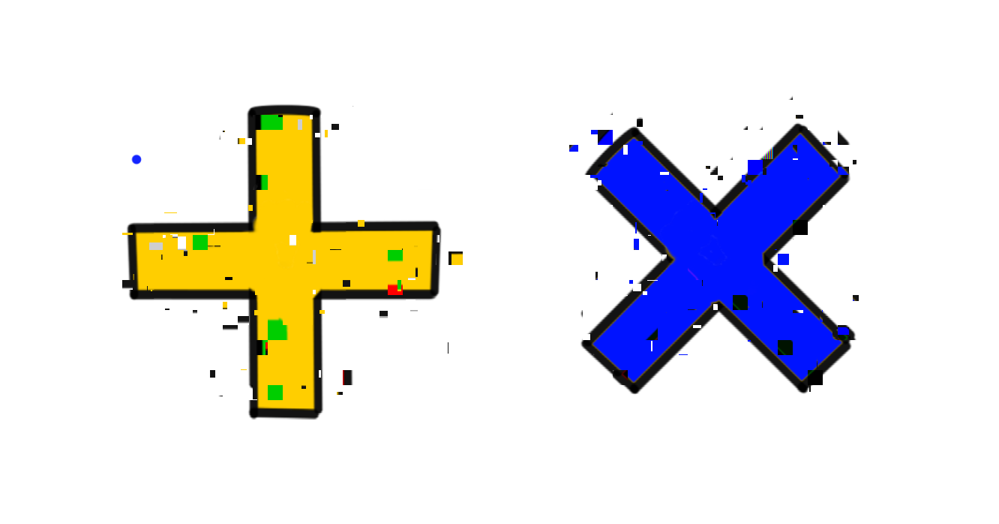

ADTs here are Algebraic data types. Though their counterparts Abstract data types also have the ADT
acronym. Hence the name of the post "The other ADTs". What are they and why do they matter? If you
have used a modern multi-paradigm language, you probably have used an abstract data type. In
abstract data types we have a type for which the concrete implementation is not known, only a
handful of operations and values are exposed to the user. The most common example of these types are
Java's collections. Java has interfaces for each type of collection that are abstract and are
implemented in various ways, useful for various scenarios. E.g. Java's `Map` has many concrete
implementations i.e. `LinkedHashMap` which preserves the order of insertion, `HashMap` which is a
normal hash map implementation and `TreeMap` which stores keys in a sorted in a sorted order using a
binary tree. The nice thing about abstract data types is that implementations are opaque to the user
and can be changed without changing the behavior of the exported interfaces.

## Algebraic data types

Algebraic data types are types that are made by composing other types. They are, in contrast to
abstract data types, almost always concrete. Two most common ways to combine types is by "sum" and
"product", also known respectively as sum types and product types. Product types allow you to have
more than one value in a structure _at the same time_. Great examples of these are _records_, _data
classes_,_tuples_, _pairs_ and _structs_ etc. in your favorite language. Sum types on the other hand
only allow for one value at a time out of a fixed set of values. These are the _enum_, _disjoint
unions_ and _sealed classes_ etc. in your language of choice. For product types, the total number
possible values it can take is the of the number of possible values of its constituents. Similarly
for sum types, the number is the sum of possible values of its constituents. Algebraic data types
are especially used in functional first languages. Haskell and other ML inspired languages have
syntaxes that support algebraic types. Over time they grew in popularity and were adopted by many
modern multi- paradigm languages. Here is an example of `Bool` type in Haskell.

```haskell
data Bool = False | True
```

With this line of code me are creating a new data type `Bool`, which has two data constructors,
`True` and `False`, that are used to construct a value of type `Bool`. Hence, a value that is of
type `Bool` can either be `True` or `False` . For a more complicated example of this we construct
the classic shape data type from OOP.

```haskell
data Shape = Rect Float Float
			 | Circle Float
			 | Triangle Float Float Float
```

This creates a shape that has three constructors, Rect, Circle and Triangle. This type can be used
by calling any of the constructors.

```haskell
circle = Circle 5
rect = Rect 5 10
```

If you check the types of these values in the REPL with `:type` , you would see that both are of
`Shape` type. Here Circle or Rect are not data types on their own, they are just data constructors.
Multi-paradigm languages such as type-script from the JS world and Scala, Kotlin from the JVM world
all have capabilities to define abstract data types. Here's the same thing implemented in Kotlin.

```kotlin
sealed class Shape
data class Rect(val length: Float, val width: Float): Shape()
data class Circle(val radius: Float): Shape()
data class Triangle(val a: Float, val b: Float, val c: Float): Shape()
```

Well, you would say that this is just a class hierarchy, where Shape is abstract and other classes
are just concrete implementations. You would be right to think so, but there's a catch, you cannot
subclass outside the file and a sealed class has a private default constructor. This creates the
same effect as sum types. Ok this is all fine and dandy, but how do we consume these types? Enter
_pattern matching_.

## Pattern matching

Let’s say me need to get area of the Shape type, we define a function in Haskell as,

```haskell
area :: Shape -> Float
area (Rect a b) = a * b
area (Circle r) = pi * r * r
area (Triangle a b c) = sqrt(s * (s-a) * (s-b) * (s-c)) where s = (a+b+c)/2
```

What me have done here is defined a function `area` that matches its input with the proper branch
and executes the proper branch of the function. Here, the compiler will complain if you forget to
implement for a branch. Same thing implemented in Kotlin using `when` expression .

```kotlin
import kotlin.math.*

fun area(shape: Shape): Float = when(shape){
	is Rect -> shape.length * shape.width
	is Circle -> PI.toFloat() * shape.radius * shape.radius
	is Triangle -> {
		val (a, b, c) = shape
		val s = (a + b + c)/2
		sqrt(s * (s - a) * (s - b) * (s - c))
	}
}
```

Hmm, cool but we could do this the abstract data type way, creating an abstract class with abstract
method area and implement concrete implementations of area in appropriate sub-classes. Well yes, we
could do this that way too, but there are trade-offs associated with both of these approaches.

## Trade-offs

With Algebraic Data Types me can add new functions to a data-type without re-compiling existing
code, but adding a new case to the data -type will require changes in all of the functions defined.
On the other hand with Abstract Data types it is easier to add new cases to the data type but adding
new functions need changes in all the cases that me previously defined. You can choose between them
according to your own use-cases This trade off has a name, the
[_expression problem_](https://eli.thegreenplace.net/2016/the-expression-problem-and-its-solutions/#id7).
There exists many solutions to the expression problem, in many ingenious ways, and depending on the
language you an working with they can incur extra complexity to you implementation. Also in most
use-cases adding types and adding functions happen at different rates, hence it may be easier to use
either of the ADTs for the task. Take a JSON expression parser, the probability of a new JSON type
being added is far less than adding a new operation to that type.

## Designing with ADTs

In the shape example, I used floats to represent the side lengths of the shapes. But this is wrong
because side lengths must be non-negative . Negative values can mess up our area function. With ADTs
me can model this problem in such a way that getting negative values as our sides would be
impossible i.e. making illegal states unrepresentable.

> Make illegal states unrepresentable —
> [Yaron Minsky](https://blog.janestreet.com/effective-ml-revisited/)

<!-- ```kotlin
class Side(side: Float){
	val side = side
		get(): Float? = if(field < 0) null else field
}
```

Now every accessor of side has to account for the fact that side is not always a floating value and could be null. In Haskell we would name made a side type with Maybe type like `haskell>data Side = Maybe Float` but Kotlin has nullability handling built into it.  -->

A more detailed treatment of this topic can be found on
[Scott Walschin’s website F# for fun and profit.](https://fsharpforfunandprofit.com/series/designing-with-types.html).

ADTs can be a very powerful tool for constructing robust applications that are hard to break. They
also try to bridge the gap between statically and dynamically typed languages. You could do things
like passing a function or an integer in a single expression. ADTs make it very easy to represent
robust data types that go a long way towards documenting what our functions do and help in
refactoring them.
