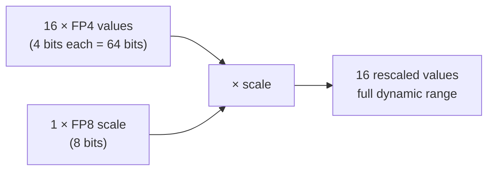
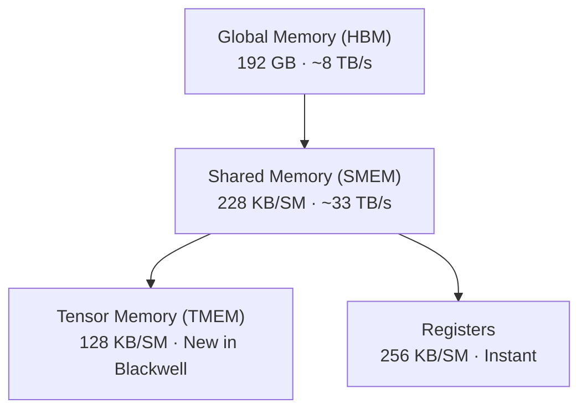
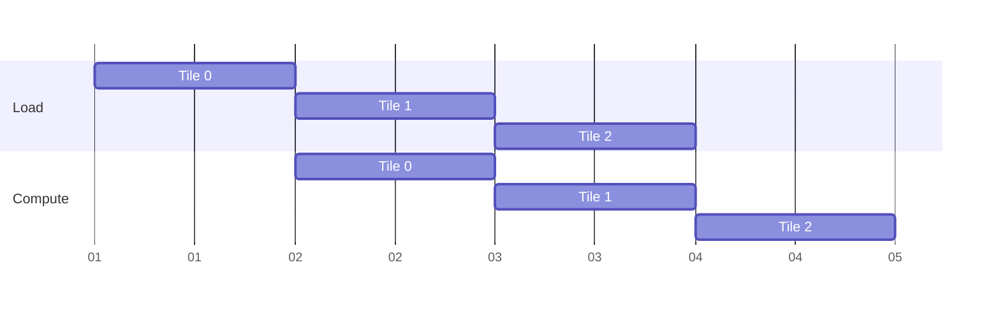
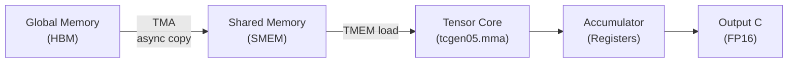
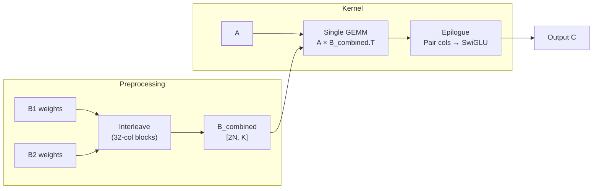
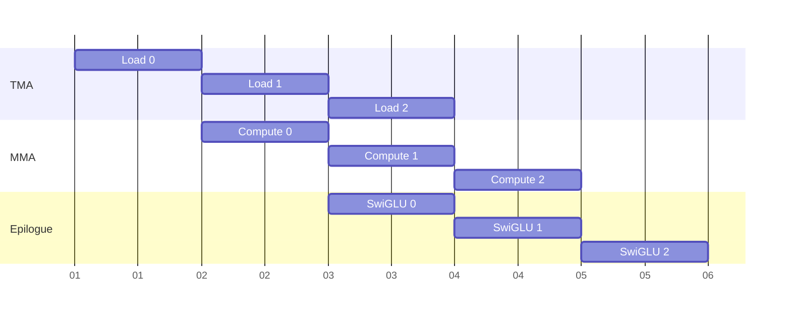

# **Squeezing LLMs into 4 Bits on Blackwell GPUs**

GPU Mode Kernel Competition

Amandeep Singh

<div class="absolute top-8 right-8 text-4xl font-bold text-red-500 opacity-60 rotate-12 border-4 border-red-500 px-4 py-1 rounded">DRAFT</div>

---

## The Problem

<v-clicks>

- LLM inference is expensive — frontier models (405B+) still need **hundreds of GBs** even at FP16
- 4-bit quantization is now standard, but how do you **write the kernels** that make it fast?
- Autoregressive decoding is **memory-bound**: each token reads the full weight matrix, but only computes one row of output — the GPU spends most of its time waiting on memory, not doing math
- Going from FP16 → FP4 is a ~3.6× memory reduction (4.5 bits/value with block scaling) — **less memory to move means faster inference**

</v-clicks>

---

## Quantization

<v-clicks>

- Map high-precision values (FP32/FP16) → low-precision (FP8/FP4)
- **Why it works**: model weights are approximately **normally distributed**
  - Most values cluster near zero — few bits needed
  - Outliers are rare and handled with scaling factors
- Result: **< 1% accuracy loss** at 4-bit precision
- This is the key insight behind modern LLM inference

</v-clicks>

---

## The Float Zoo

| Format | Bits | Range | Use case |
|--------|------|-------|----------|
| FP32   | 32   | ±3.4 × 10³⁸ | Training (baseline) |
| BF16   | 16   | ±3.4 × 10³⁸ | Training / inference |
| FP16   | 16   | ±65504 | Mixed-precision training |
| FP8 (E4M3) | 8 | ±448 | Inference |
| **NVFP4 (E2M1)** | **4** | **±6** | **Inference (Blackwell)** |

<v-click>

**The catch:** NVFP4 can only represent values in [−6, 6] — it needs a **per-group scale factor** to compensate

</v-click>

---

## Block Scaling — The Key Idea

Every group of **16 FP4 values** shares **one FP8 scale factor**



**Storage cost:** 16 × 4 + 8 = **72 bits** for 16 values → **4.5 bits/value** average

<v-click>

This is the NVFP4 format — natively supported on Blackwell GPUs

</v-click>

---

## GPU Memory Hierarchy



<v-click>

**Key insight: moving data costs more than computing with it**

Every optimization in this talk is fundamentally about minimizing data movement

</v-click>

---

## The Challenge

<v-clicks>

**GPU Mode NVFP4 Kernel Competition** — four kernels, escalating difficulty

All targeting **NVIDIA B200 (Blackwell)**

1. **GEMV** — matrix × vector (warm-up)
2. **GEMM** — matrix × matrix (main event)
3. **Dual GEMM + SwiGLU** — production MLP layer (boss level)
4. **Grouped GEMM** — batched variable-size GEMMs (grand prix)

Goal: beat the "speed of light" reference times in **microseconds**

</v-clicks>

---
layout: two-cols
---

## What Makes Blackwell Special

**Memory System**

- **TMA** — Tensor Memory Accelerator
  - Hardware-driven async memory copies
  - No thread involvement needed
- **TMEM** — Tensor Memory
  - Dedicated memory for matrix operands
  - Direct feed to tensor cores

::right::

<div class="mt-12">

**Compute**

- **tcgen05.mma**
  - Native block-scaled FP4 matrix multiply
  - 128 × 128 × 256 tile in one instruction
  - Accepts FP4 data + FP8 scales directly

These aren't just faster — they're **new hardware units** we'll see in action

</div>

---
layout: section
---

# Challenge 1: GEMV

The Warm-Up

---

## GEMV — The Problem

Matrix × vector: each output element reads the entire K dimension

$$C[m] = \sum_{k} A[m, k] \cdot B[k]$$

- Output is small (a vector), input is large (a matrix)
- Every row of A is used exactly once — **no data reuse**

<v-click>

**Initial hypothesis:** this is compute-bound — let's optimize the math!

</v-click>

---

## The Optimization Journey

<v-clicks>

1. Basic implementation — it works ✓
2. Vectorized FP4 loads (8 values per load) — faster
3. Warp shuffle reductions — faster still
4. Software pipelining — marginal gains
5. Shared memory staging — no improvement
6. Aggressive prefetching...
7. **Attempts 8–12 were SLOWER**

</v-clicks>

---
layout: center
class: text-center
---

## The Counter-Intuitive Insight

<v-clicks>

### "Profile before you optimize"

GEMV is **memory-bound**, not compute-bound

The GPU's hardware prefetcher was already doing a great job

Our "clever" optimizations were **fighting the hardware**

**Sometimes the best optimization is no optimization**

</v-clicks>

---

## GEMV — The Winning Code

```cpp {1-3|5-8|10-15}
// Phase 1: Vectorized FP4 load — 16 values in one 4-byte read
uchar4 a4 = *reinterpret_cast<const uchar4*>(&a_ptr[offset]);
uchar4 b4 = *reinterpret_cast<const uchar4*>(&b_ptr[offset]);

// Phase 2: Decode FP4 pairs, scale, and accumulate
__half2 scale = __halves2half2(decode_fp8(sfa), decode_fp8(sfb));
__half2 dot = dot_scaled_4bytes(a4, b4, scale);
row_sum += __half2float(dot.x) + __half2float(dot.y);

// Phase 3: Warp shuffle tree reduction (32 threads → 1 result)
row_sum += __shfl_down_sync(0xffffffff, row_sum, 16);
row_sum += __shfl_down_sync(0xffffffff, row_sum, 8);
row_sum += __shfl_down_sync(0xffffffff, row_sum, 4);
row_sum += __shfl_down_sync(0xffffffff, row_sum, 2);
row_sum += __shfl_down_sync(0xffffffff, row_sum, 1);
```

32 threads cooperate on one row — each loads a chunk, then they reduce

---
layout: section
---

# Challenge 2: GEMM

Where Things Get Interesting

---

## GEMM is Different

$$C[m, n] = \sum_{k} A[m, k] \cdot B[n, k]$$

- Output is a **matrix** — much more work, but also much more **data reuse**
- Each row of A is used N times, each column of B is used M times

<v-click>

**NOW we're compute-bound.** This is where Blackwell's tensor cores shine.

</v-click>

---
layout: two-cols
---

## Tiling & Pipelining

**Why tile?**

Matrices don't fit in fast memory. Process in **128 × 128** chunks that do.

Each tile of A and B is loaded into shared memory, multiplied by tensor cores, and accumulated.

::right::

<div class="mt-12">

**Why pipeline?**

Load tile N+1 **while** computing tile N. Hide memory latency behind compute.



</div>

---

## Blackwell GEMM Pipeline



- **TMA** handles all data movement — no thread math for addresses
- **tcgen05.mma** natively consumes FP4 data + FP8 scales in one instruction
- Pipeline keeps all stages busy simultaneously

---

## GEMM — Pseudocode

```python {1-3|5-9|11-14|16-17}
# Allocate tile buffers in shared memory
smem_A = shared_memory(128, 256)  # 128 rows × 256 cols
smem_B = shared_memory(128, 256)

# Pipelined main loop over K dimension
for k_tile in range(0, K, 256):
    tma_load_async(smem_A, A[m_blk, k_tile:k_tile+256])
    tma_load_async(smem_B, B[n_blk, k_tile:k_tile+256])
    pipeline_barrier()  # wait for current tile

    # Tensor core MMA — native block-scaled FP4
    acc += tcgen05_mma(smem_A, smem_B,
                       scale_A[m_blk, k_tile // 16],
                       scale_B[n_blk, k_tile // 16])

# Store result
C[m_blk, n_blk] = acc.to(fp16)
```

---

## GEMM Takeaways

<v-clicks>

- **TMA** for loads — zero thread overhead for memory management
- **Multi-stage pipeline** — overlap memory and compute
- **TMEM** for scale factors — dedicated fast path to tensor cores
- CuTe abstractions handle the complexity of tiling and indexing

</v-clicks>

<v-click>

But this was just a building block. The real challenge was **putting two GEMMs together**.

</v-click>

---
layout: section
---

# Challenge 3: Dual GEMM + SwiGLU

The Boss Level

---

## What is SwiGLU?

The activation function in **every modern LLM's MLP layer**:

$$C = \text{silu}(A \cdot B_1^T) \odot (A \cdot B_2^T)$$

where $\text{silu}(x) = x \cdot \sigma(x)$

<v-click>

**Naive approach:** two separate GEMMs

- Load A **twice** from global memory
- Write two intermediate matrices
- Read them back for the element-wise ops

That's **3× the memory traffic** we need

</v-click>

---

## The Fusion Insight

**Interleave** B1 and B2 → run **one** GEMM → fuse SwiGLU in the **epilogue**



<v-click>

**One** matrix load, **one** GEMM, **zero** intermediate writes

</v-click>

---
layout: two-cols
---

## Warp Specialization

Three warp groups, each with a dedicated job:

| Role | Job |
|------|-----|
| **TMA Warp** | Load A, B tiles |
| **MMA Warp** | Tensor core math |
| **Epilogue Warps** | SwiGLU + store |

All three run **simultaneously**

::right::

<div class="mt-10">



Division of labor — a **3-stage producer-consumer** pipeline

</div>

---

## The Epilogue — SwiGLU Fusion

```python {1-3|5-7|9-10}
# Interleaved columns: [up0, gate0, up1, gate1, ...]
for i in range(0, 128, 64):        # 32-col pairs
    up   = acc[:, i:i+32]          # "up" projection
    gate = acc[:, i+32:i+64]       # "gate" projection

    # SwiGLU: silu(gate) * up
    gate_act = gate * sigmoid(gate) # silu
    result = up * gate_act

    # Store fused result — no intermediate memory writes
    C[:, i//2 : i//2+32] = result.to(fp16)
```

The 32-column interleaving makes pairing **trivial** — adjacent blocks are always (up, gate) pairs

---
layout: center
---

## Data Flow — The Complete Picture


---

## Challenge 4: Grouped GEMM — The Grand Prix

Multiple **variable-size** GEMMs batched together — the real-world workload

- Each group has different M, but shared N and K
- Must schedule work efficiently across groups with **very different sizes**

<v-click>

**What makes it hard:**

- Small Ms (40–384) mean many groups are **memory-bound**, not compute-bound
- Load imbalance — one group at M=40, another at M=320
- Need persistent kernels or clever work partitioning to keep the GPU busy

</v-click>

<v-click>

*I ran out of time on this one — analysis of top solutions to follow*

</v-click>

---

## Performance Targets

| Challenge | Config | Target (μs) |
|-----------|--------|------------|
| **GEMV** | M=7168, K=16384 | 8.6 |
| **GEMV** | M=4096, K=7168, L=8 | 17.3 |
| **GEMM** | M=128, N=7168, K=16384 | 9.0 |
| **GEMM** | M=128, N=4096, K=7168 | 2.4 |
| **Dual GEMM** | M=256, N=4096, K=7168 | 4.7 |
| **Dual GEMM** | M=512, N=4096, K=7168 | 8.7 |
| **Grouped** | 8 groups, N=4096, K=7168 | 18.8 |
| **Grouped** | 2 groups, N=3072, K=4096 | 2.4 |

<v-click>

**Speed of light** targets on B200 — bounded by memory bandwidth (GEMV) vs tensor core throughput (GEMM / Dual GEMM / Grouped)

</v-click>

---

## Key Lessons

<v-clicks>

1. **Profile before optimizing** — GEMV taught us that hardware prefetching can beat manual optimization
2. **Understand the hardware** — memory hierarchy dominates; know which level you're bound by
3. **Data movement > compute** — fusion isn't about saving FLOPs, it's about saving bandwidth
4. **Use the right abstractions** — CuTe/CUTLASS >> raw index math
5. **Divide and conquer** — warp specialization lets different hardware units work simultaneously

</v-clicks>

---

## Resources

- **GPU Mode** — community for GPU programming (Discord + YouTube lectures)
- **NVIDIA CuTe / CUTLASS** — the framework behind these kernels
- **NVIDIA Blackwell Architecture Guide** — TMA, TMEM, tcgen05 docs

---
layout: end
---

# Questions?
