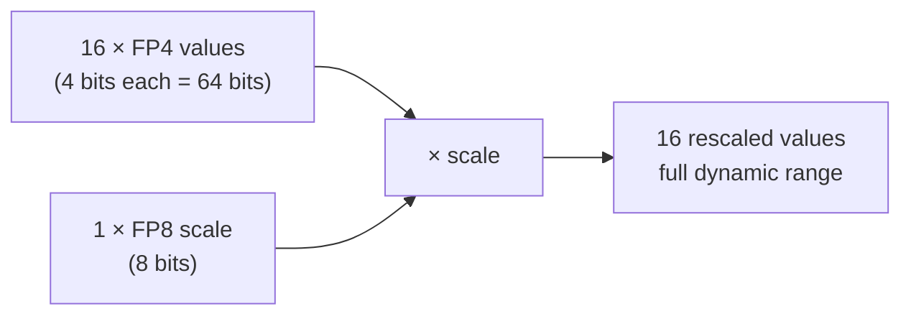

# **Twelve Attempts at an FP4 Kernel**

GPU Mode NVFP4 Kernel Hackathon

Amandeep Singh

<!--
This talk is about my experience in GPU Mode's NVFP4 kernel hackathon. I wrote 12 kernel attempts for Blackwell's new 4-bit floating point format, and most of what I learned came from the things that didn't work.
-->

---

## The Competition

<v-clicks>

- GPU Mode's NVFP4 Kernel Hackathon on **NVIDIA B200 (Blackwell)**
- Four tasks: GEMV, GEMM, Gated GEMM, Grouped GEMM
- All use **block-scaled FP4** inputs: every 16 `e2m1` elements share one `e4m3` FP8 scale factor
- Goal: get as close as possible to **speed of light** (SoL)
  - SoL = `max(time to do all the math, time to move all the data)`
  - The kernel can't run faster than whichever resource is the bottleneck
- I completed GEMV and GEMM, ran out of time for the rest

</v-clicks>

<!--
GPU Mode is a community for GPU programming. The hackathon gave us access to B200 hardware and four tasks of escalating difficulty. I'll focus on GEMV since that's where I spent most of my time and learned the most. Speed of light here means the theoretical minimum time based on the hardware's peak memory bandwidth or compute throughput, whichever is the bottleneck.
-->

---

## NVFP4 Block Scaling

Every group of **16 FP4 values** shares **one FP8 scale factor**


```mermaid
flowchart LR
    A["16 × FP4 values
    (4 bits each = 64 bits)"] --> C["× scale"]
    B["1 × FP8 scale
    (8 bits)"] --> C
    C --> D["16 rescaled values
    full dynamic range"]
```

**Storage cost:** 16 × 4 + 8 = **72 bits** for 16 values = **4.5 bits/value**

This is the NVFP4 format, natively supported on Blackwell GPUs

<!--
FP4 can only represent values in the range negative 6 to positive 6, so you need a scale factor to recover the full dynamic range. Every 16 elements share one FP8 scale factor. The effective storage is 4.5 bits per value, roughly a 3.6x reduction from FP16. This format is what all the kernels in the competition consume.
-->

---

## The GEMV Task

$$C[m] = \sum_{k} A[m, k] \cdot B[k]$$

- $A$: $M \times K \times L$ (packed FP4), $B$: $1 \times K \times L$ (packed FP4)
- Output $C$: $M \times 1 \times L$ in FP16
- Metric: geometric mean of benchmark times vs SoL

| M | K | L | Speed of Light (µs) |
|-----|-------|---|-----|
| 7168 | 16384 | 1 | 8.6 |
| 4096 | 7168 | 8 | 17.3 |
| 7168 | 2048 | 4 | 4.3 |

<!--
Matrix times vector. Each output element reads an entire row of A and the full B vector, so there's no data reuse on A. B is reused across all M rows, but each row of A is read exactly once. The SoL numbers come from the B200's DRAM bandwidth at 1.5GHz clock. These are the targets we're trying to approach.
-->

---
layout: section
---

# The Optimization Journey

12 attempts, 1 good baseline, 5 failed experiments

<!--
Let me walk through how this evolved. I started with CuTe's Python DSL, hit limitations, switched to raw C++, got a 3x-off-SoL baseline, then spent five more attempts making things worse.
-->

---

## Attempts 1-4: CuTe Python DSL

Started with CUTLASS's Python DSL. One thread per output element, sequential K loop.

```python
@cute.kernel
def _kernel(self, a, b, sfa, sfb, c):
    # ... tensor setup, local_tile ...
    for k in range(k_tiles):
        a_val = tAgA[tidx, None, k].load().to(cutlass.Float16)
        b_val = tBgB[0, None, k].load().to(cutlass.Float16)
        sfa_val = tAgSFA[tidx, None, k].load().to(cutlass.Float32)
        sfb_val = tBgSFB[0, None, k].load().to(cutlass.Float32)
        for i in cutlass.range_constexpr(self.b_k):
            tCrC += (a_val[i] * b_val[i]) * (sfa_val[i] * sfb_val[i])
```

<v-click>

Correct but slow. No K parallelism, no packed FP16 arithmetic.

</v-click>

<!--
CuTe's Python DSL lets you write GPU kernels in Python using layout algebra abstractions. I wrote about layout algebra in a separate blog post. The initial kernel was straightforward: one thread per output row, sequential loop over K. It produced correct results but was nowhere near competitive. Over attempts 2 through 4 I experimented with K-dimension tiling and thread configuration but stayed within this basic structure.
-->

---

## Attempts 5-6: Parallelizing in CuTe

<v-clicks>

- **Attempt 5**: Split-K with `atomicAdd` via custom `@dsl_user_op`
  - Atomics too expensive for a memory-bound kernel
- **Attempt 6**: Warp-shuffle reductions instead
  - 128 threads = 4 warps, each warp handles 1 row with 32-lane K splitting
  - Better, but hit a wall: needed packed `fma.rn.f16x2`
  - CuTe DSL has `fma_packed_f32x2` but no `fma_packed_f16x2` wrapper
  - Tried `llvm.inline_asm` wrappers, couldn't get them working

</v-clicks>

<v-click>

In hindsight this was a skill gap. A top 10 solution (21.6µs) did exactly this in pure CuTe with a single `llvm.inline_asm` block.

</v-click>

<!--
In attempt 5 I split K across threads and used atomicAdd to accumulate. The atomics were too expensive. Attempt 6 replaced them with warp shuffles, which was better, but I needed packed half2 FMA instructions and couldn't get the CuTe DSL to emit them. The DSL has fma_packed_f32x2 but no f16x2 equivalent. I tried writing llvm.inline_asm wrappers but couldn't get the MLIR type constraints right. I later found out another competitor placed top 10 at 21.6 microseconds using exactly this approach in pure CuTe. The inlining is straightforward once you get the constraint strings right. I just didn't push through it.
-->

---

## Attempt 7: Raw CUDA C++

Rewrote from scratch via `torch.utils.cpp_extension.load_inline`

- 32 threads (one warp) per output row
- 128 threads/block, 4 rows/block
- Vectorized `uchar4` loads (8 FP4 values per 4-byte read)
- Warp shuffle reduction

<!--
I scrapped CuTe and rewrote in raw CUDA C++. The structure: one warp of 32 threads per output row. Each thread handles a strided slice of K, accumulates locally in FP32, then the warp reduces with shuffle instructions. 128 threads per block means 4 rows processed per block.
-->

---

## The Key Function

The packed `half2` decode-scale-multiply pipeline:

```cpp
__device__ __forceinline__ __half2 dot_scaled_4bytes(
    uchar4 a4, uchar4 b4, __half2 scale_h2
) {
    __half2 acc0 = __hmul2(decode_fp4x2(a4.x),
                           __hmul2(decode_fp4x2(b4.x), scale_h2));
    __half2 acc1 = __hmul2(decode_fp4x2(a4.y),
                           __hmul2(decode_fp4x2(b4.y), scale_h2));
    acc0 = __hfma2(decode_fp4x2(a4.z),
                   __hmul2(decode_fp4x2(b4.z), scale_h2), acc0);
    acc1 = __hfma2(decode_fp4x2(a4.w),
                   __hmul2(decode_fp4x2(b4.w), scale_h2), acc1);
    return __hadd2(acc0, acc1);
}
```

This is where the speedup came from vs the CuTe attempts.

<!--
This is the core function. Each uchar4 is 4 bytes, which is 8 FP4 values. decode_fp4x2 uses Blackwell's __nv_cvt_fp4x2_to_halfraw2 intrinsic to convert a byte into a half2 pair. Then we do the scale-multiply-accumulate entirely in paired half2 operations using hmul2 and hfma2. This avoids the scalar FP32 overhead I had in the CuTe attempts. The rest of the kernel, the strided K loop and warp reduction, is fairly standard. This function is what made the difference.
-->

---

## Attempt 7: Results

| M | K | L | My kernel (µs) | SoL (µs) | Ratio |
|-----|-------|---|------|------|-------|
| 7168 | 16384 | 1 | 26.7 | 8.6 | 3.1x |
| 4096 | 7168 | 8 | 45.1 | 17.3 | 2.6x |
| 7168 | 2048 | 4 | 16.4 | 4.3 | 3.8x |

~3x off speed of light. This became my baseline.

<!--
About 3x off speed of light across all three benchmarks. This became the baseline everything else was measured against.
-->

---
layout: section
---

# The Failed Experiments

Attempts 8-12: all slower or no effect

<!--
Now the part where I learned the most. Five more attempts, all of which made things worse or had zero effect.
-->

---

## What Didn't Work

| Attempt | Technique | Result |
|---------|-----------|--------|
| 8 | Split-K with `atomicAdd` | Slower (contention + extra mem traffic) |
| 9 | Wider loads (`uint2` / 64-bit) | 16-25% slower (byte extraction overhead) |
| 10 | 4 accumulator chains (ILP) | **32-55% slower** (register spilling, wrong bottleneck) |
| 11 | `-maxrregcount=64`, block size tuning | 0% change |
| 12 | Software pipelining | 0% change (HW prefetcher already sufficient) |

<v-click>

The kernel is **memory-bound**. Every one of these optimizes for the wrong thing.

I should have run Nsight Compute after attempt 7.

</v-click>

<!--
Attempt 8: split-K with atomics in C++ this time. Still too expensive, atomic contention and extra memory traffic.

Attempt 9: wider uint2 loads instead of two uchar4 loads. 16-25% slower because extracting bytes from uint2 needs bitwise ops. The compiler already optimizes consecutive uchar4 loads.

Attempt 10 was the worst. Four independent accumulator chains to hide FMA latency through ILP. 32-55% regression. The kernel is memory-bound, not compute-bound. FMA latency is irrelevant when you're waiting on memory. The extra accumulators caused register spilling.

Attempt 11: register count and block size tuning. Zero effect. The kernel already uses few registers.

Attempt 12: software pipelining. Zero effect. The B200's hardware prefetcher is already doing this.

The lesson: I should have profiled with Nsight Compute after attempt 7. It would have told me immediately that the kernel was memory-bound, and I would have known that all these compute-side optimizations were pointless.
-->

---

## Why 3x Off Speed of Light?

<v-clicks>

- GEMV is fundamentally memory-bound
  - FP4 data is tiny (4 bits/element), arithmetic intensity is low
  - SoL is bounded by DRAM bandwidth, not compute
- Even the top 3 solutions only reached ~2x off SoL
  - The gap from 2x to 1x may require approaches beyond what anyone used
- The gap from my 3x to the winners' 2x: execution details

</v-clicks>

<!--
GEMV with FP4 data has very low arithmetic intensity. You're reading tiny amounts of data and doing a small number of FLOPs per element. The speed of light is bounded by DRAM bandwidth. Even the best solutions in the competition only reached about 2x off. The remaining gap from 2x to 1x is genuinely hard and may require fundamentally different approaches. But the gap between my 3x and their 2x was all about execution details, which I'll cover next.
-->

---
layout: section
---

# What the Winners Did

Top 3: ~18.5µs geometric mean (~2x SoL)

---

## Top Solutions: Inline PTX + Cache Control

All three wrote loads and decodes in raw PTX

<v-clicks>

- `cvt.rn.f16x2.e2m1x2` instead of `__nv_cvt_fp4x2_to_halfraw2`
- `ld.global` with explicit cache qualifiers instead of `__ldg`
- **Differentiated cache hints for A vs B**:
  - A (streamed once): `L1::no_allocate`
  - B (reused across all rows): `L1::evict_last`
  - My `__ldg` makes no distinction

</v-clicks>

<!--
All top 3 solutions used inline PTX assembly for loads and decode. Where I used C intrinsics like __nv_cvt_fp4x2_to_halfraw2, they wrote the PTX conversion instruction directly. Where I used __ldg for cached reads, they used ld.global with explicit cache qualifiers.

The biggest gap was cache policy control. Matrix A is streamed once per row, so they used L1::no_allocate to avoid polluting L1 cache. Vector B is reused across all M rows, so they used L1::evict_last to keep it hot. My __ldg treats everything the same. This distinction alone probably accounts for a significant chunk of the performance gap.
-->

---

## Top Solutions: Load Width + Specialization

<v-clicks>

- **128-bit and 256-bit vectorized loads**
  - `ld.global.v2.u64` (128-bit) and `ld.global.v4.u64` (256-bit)
  - PTX byte unpacking (`mov.b32 {a,b,c,d}, %reg`) avoids bitwise extraction
  - This is why wider loads worked for them but not for my attempt 9
- **Compile-time K specialization**
  - Template on exact K dimension, dispatch at launch
  - Full unroll with known trip count
  - Rank 1: per-K cache hint tuning (K=3584 vs K=8192 vs K=1024)
- **Tighter register budgets**
  - Rank 1: `-maxrregcount=32`, Rank 3: 45. I used 80.

</v-clicks>

<!--
They also used much wider loads. I was doing 32-bit uchar4 loads. They did 128-bit and 256-bit loads via PTX, fetching 32 or 64 FP4 values at once. The key difference from my failed attempt 9 with uint2 is that they used PTX byte unpacking instructions to extract the individual bytes, which avoids the bitwise overhead that killed my approach.

They also templated on the exact K value so the compiler could fully unroll. Rank 1 even used different cache hints per K value. And their register budgets were much tighter: 32 registers for rank 1, vs my 80. Lower register count means higher occupancy, which is what a memory-bound kernel needs.
-->

---

## The Surprise

A pure PyTorch solution using `torch._scaled_mm` with multi-stream parallelism scored **22.4µs**

No custom kernels, just calling into cuBLAS's FP4 path

That's within 20% of the top 3 PTX solutions and faster than my hand-written C++ kernel

<!--
This one was humbling. Someone submitted a solution that just calls torch._scaled_mm, which routes to cuBLAS's native FP4 path, with multi-stream parallelism across the L batch dimension. 22.4 microseconds. No custom CUDA code at all. Faster than my 12 attempts of hand-written kernels. Within 20% of the top PTX solutions. Know when to reach for the library.
-->

---

## Leaderboard Context

| Approach | Time (µs) | vs SoL |
|----------|-----------|--------|
| Speed of Light | ~8.6 | 1x |
| **Top 3 (inline PTX)** | **~18.5** | **~2x** |
| CuTe + inline asm (top 10) | 21.6 | ~2.5x |
| `torch._scaled_mm` (PyTorch) | 22.4 | ~2.6x |
| My C++ kernel (attempt 7) | ~27 | ~3x |

<!--
Here's the full picture. The SoL numbers are for the first benchmark, M=7168 K=16384 L=1 to give a rough sense of where everything lands. The top 3 all used inline PTX with cache control and were clustered around 18.5 microseconds. The CuTe solution and the PyTorch solution are close to each other around 21-22 microseconds. My kernel is at 27.
-->

---

## Takeaways

<v-clicks>

1. Profile before optimizing. I should have run Nsight Compute after attempt 7.
2. The CuTe DSL can do it. I couldn't get `llvm.inline_asm` working but another competitor did. Skill gap, not a tooling gap.
3. For memory-bound kernels, execution details matter more than algorithmic cleverness: cache policies, load widths, register pressure, compile-time specialization.
4. `torch._scaled_mm` scored 22.4µs with zero custom code. Know when to reach for the library.

</v-clicks>

<!--
Four things I took away. First, profile. Nsight Compute would have saved me five wasted attempts. Second, the CuTe DSL wasn't the bottleneck, I was. Another competitor proved it works. Third, for memory-bound kernels, the algorithm is table stakes. The gap is in execution details: cache control, load widths, register pressure. Fourth, before writing a single line of CUDA, check if torch._scaled_mm already does what you need.
-->

---
layout: end
---

# Questions?

Blog post: [amandeepsp.github.io/blog/nvfp4-balackwell-gemv](/blog/nvfp4-balackwell-gemv)

Source code: [github.com/amandeepsp/cuda](https://github.com/amandeepsp/cuda)
