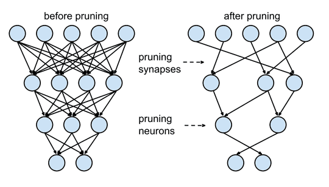
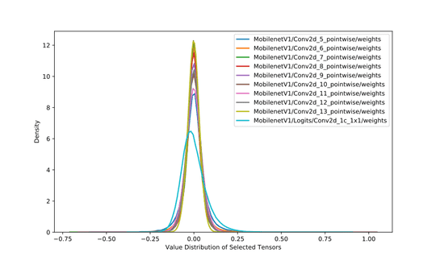
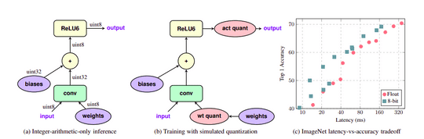
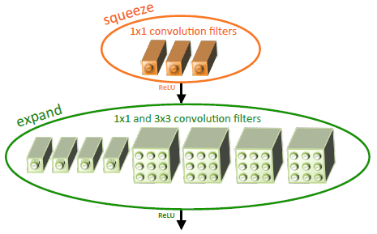
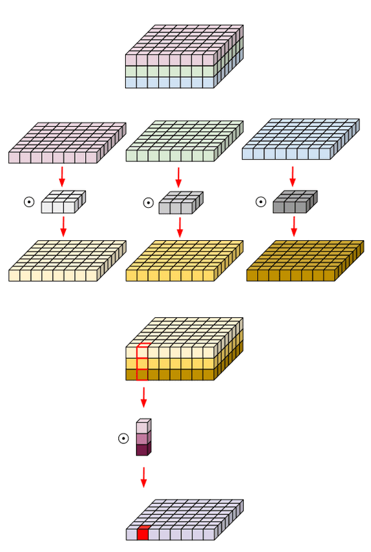
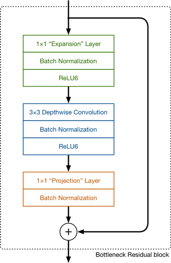
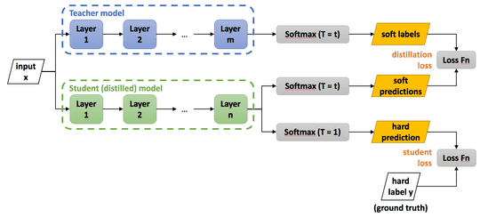

Machine Learning models are getting bigger and expensive to compute. Embedded devices have restricted memory, computation power and battery. But we can optimize our model to run smoothly on these devices. By reducing the size of the model we decrease the number of operations that need to be done hence reducing the computation. Smaller models also trivially translate into less memory usage. Smaller models are also more power-efficient. One must think that a reduced number of computations is responsible for less power consumption, but on the contrary, the power draw from memory access is about 1000x more costly than addition or multiplication. Now since there are no free lunches i.e. everything comes at a cost, we lose some accuracy of our models here. Bear in mind these speedups are not for training but inference only.

## Pruning

Pruning is removing excess network connections that do not hugely contribute to the output. Ideas of pruning networks are very old dating back to 1990s namely _[Optimal Brain Damage](https://papers.nips.cc/paper/250-optimal-brain-damage.pdf)_ and _[Optimal Brain Surgeon](https://papers.nips.cc/paper/749-optimal-brain-surgeon-extensions-and-performance-comparisons.pdf)_. These methods use Hessians to determine the importance of connections, which also makes them impractical to use with deep networks. Pruning methods use an iterative training technique i.e. _Train ⇒ Prune ⇒ Fine-tune_. Fine-tuning after pruning restores the accuracy of the network lost after pruning. One method is to rank the weights in the network using the L1/L2 norm and remove the last x% of them. Other types of methods which also use ranking use the mean activation of neurons, the number of times a neuron's activation is zero on a validation set and many other creative methods. This approach is pioneered by [Han et.al.](https://arxiv.org/abs/1506.02626) in their 2015 paper.



_Fig 1. Pruning in neural networks from [Han et. al.](https://arxiv.org/abs/1506.02626)_

Even more recently in 2019, the [Frankle et.al.](https://arxiv.org/abs/1803.03635) paper titled *The Lottery Ticket Hypothesis* the authors found out that within every deep neural network there exists a subset of it which gives the same accuracy for an equal amount of training. These results hold for unstructured pruning which prunes the whole network which gives us a sparse network. Sparse networks are inefficient on GPUs since there is no structure to their computation. To remedy this, structured pruning is done, which prunes a part of the network e.g. a layer or a channel. The Lottery Ticket discussed earlier is found no to work here by [Liu et.al.](https://arxiv.org/abs/1810.05270) They instead discovered that it was better to retrain a network after pruning instead of fine-tuning. Aside from performance is there any other use of sparse networks? Yes, sparse networks are more robust to noise input as shown in a paper by [Ahmed et.al.](https://arxiv.org/abs/1903.11257) Pruning is supported in both TF (`tensorflow_model_optimization` package) and PyTorch (`torch.nn.utils.prune`).

To use pruning in PyTorch you can either select a technique class from `torch.nn.utils.prune` or implement your subclass of `BasePruningMethod`.

```python
from torch.nn.utils import prune
tensor = torch.rand(2, 5)
pruner = prune.L1Unstructured(amount=0.7)
pruned_tensor = pruner.prune(tensor)
```

To prune a module we can use pruning methods (basically wrappers on the classes discussed above) given in `torch.nn.utils.prune` and specify which module you want to prune, or even which parameter within that module.

```python
conv_1 = nn.Conv(3, 1, 2)
prune.ln_structured(module=conv_1, name='weight', amount=5, n=2, dim=1)
```

This replaces the parameter `weight` with the pruned result and adds a parameter `weight_orig` that stores the unpruned version of the input. The pruning mask is stored as `weight_mask` and saved as a module buffer. These can be checked by the `module.named_parameters()` and `module.named_buffers()`. To enable iterative pruning we can use just apply the pruning method for the next iteration and it just works, due to `PruningContainer` as it handles computation of final mask taking into account previous prunings using the `compute_mask` method.

## **Quantization**

Quantization is to restrict the number of possible values a weight can take, this will reduce the memory a weight can reduce and in turn reduce the model size. One way of doing this is changing the bit-width of the floating-point number used for storing the weights. A number stored as a 32-bit floating-point or FP32 to an FP16 or an 8-bit fixed-point number and more increasingly an 8-bit integer. Bit width reductions have many advantages as below.

- Moving from 32-bit to 8-bit gives us a *4x* memory advantage straight away.
- Lower bit width also means that we can squeeze me more numbers in registers/caches with leads to less RAM access and in-turn less time and power consumption.
- Integer computation is always faster than floating-point ones.

This works because neural nets are pretty robust to small perturbations to their weights and we can easily round off them without having much effect on the accuracy of the network. Moreover, weights are not contained in very large ranges due to regularization techniques used in training, hence we do not have to use large ranges, say ~ $−3.4×10^{38}$ to $3.4×10^{38}$ for a 32-bit floating -point. For example, in the image below the weight values in MobileNet are all very close to zero.



_Fig 2. Weight distribution of 10 layers of MobileNetV1._

A Quantization scheme is how we transform our real weights to quantized one, a very rudimentary form of the scheme is linear scaling. Say we want to transform values in range $[r_{min},r_{max}]$ to an integer range of $[0, I_{max}]$, where $I_{max}$ is $2^B -1$ , 𝐵 being the bit-width of our integer representation. Hence,

$$r = \frac {r_{max} - r_{min}} {I_{max} - 0} {(q - z)} = s(q -z) $$

where *r* is the original value of the weight, 𝑠 is the scale, 𝑞*q* is the quantized value and 𝑧 is the value that maps to `0.0f`. This is also known as an *affine mapping*. Since 𝑞 is integer results are rounded off. Now the problem arises how we choose $ r*{min}$ and$ r*{max}$. A simple method to achieve this is generating distributions of weights and activations and then taking their *[KL divergences](https://en.wikipedia.org/wiki/Kullback%E2%80%93Leibler_divergence)* with quantized distributions and use the one with min divergence from the original. A more elegant way to do this is using *Fake Quantization* i.e. introduce quantization aware layers into the network during training. This idea is proposed by *[Jacob et. al.](https://arxiv.org/abs/1712.05877)*.



*Fig 3. (a) Normal conv layer, (b) Conv layer with fake quantization units added, (c) Comparison of quantized network's latency and accuracy. Image from* *[Jacob et.al.](https://arxiv.org/abs/1712.05877)*

While training the *Fake quantization* node calculates the ranges for the weights and activations and store their moving average. After training, we quantize the network with this range to get better performance.

More drastic bit-width also explored in papers on XOR nets by *[Rastegari et.al](https://arxiv.org/abs/1603.05279)*, Ternary nets by *[Courbariaux et. al.](https://arxiv.org/abs/1602.02830)* and Binary nets by *[Zhu et. al.](https://arxiv.org/abs/1612.01064)* In PyTorch 1.3, quantization support was introduced. Three new data types are introduced for quantization operations `torch.quint8`, `torch.qint8` and `torch.qint32`. It also offers various qunatization techniques included in `torch.quantization` package.

- **Post Training Dynamic quantization** : Replaces float weights with dynamic quantized versions of them. Weight-only quantization by default is performed for layers with large weights size - i.e. Linear and RNN variants.

  ```python
  quantized_model = torch.quantization.quantize_dynamic(
      model, {nn.LSTM, nn.Linear}, dtype=torch.qint8
  )
  ```

- **Post Training Static quantization** : Static quantization not only converts float weights to int, but it also records the distribution of activations and they are used to determine the scale of quantization at inference time. To support this calibration type quantization we add `QuantStub` at the start of the model and `DeQuantStub` and the end of the model. It involves steps mentioned below.

  ```python
  myModel = load_model(saved_model_dir + float_model_file).to('cpu')
  # Fuse Conv, bn and relu
  myModel.fuse_model()

  # Specify quantization configuration
  # Start with simple min/max range estimation and per-tensor
  # quantization of weights
  myModel.qconfig = torch.quantization.default_qconfig

  torch.quantization.prepare(myModel, inplace=True)

  # Calibrate with the training set
  evaluate(myModel, criterion, data_loader,
              neval_batches=num_calibration_batches)

  # Convert to quantized model
  torch.quantization.convert(myModel, inplace=True)
  ```

- **Quantization Aware Training** : Uses *fake quantization* modules to store scales while training. For enabling QAT, we use the `qconfig` to be `get_default_qat_qconfig('fbgemm')` and instead of `prepare` use `prepare_qat`. After this, we can train or fine-tune our model and at the end of the training, get out the quantized model using `torch.quantization.convert` same as above.

Post-training quantization in PyTorch currently only support operations on CPU.

For detailed code examples visit the PyTorch documentation *[here](https://pytorch.org/tutorials/advanced/dynamic_quantization_tutorial.html)*. On Tensorflow side of things quantization can be done using TFLite's `tf.lite.TFLiteConverter` API by setting the `optimizations` parameter to `tf.lite.Optimize.OPTIMIZE_FOR_SIZE`. Fake quantization is enabled by `tf.contrib.quantize` package.

## **Low Rank Transforms**

Low-rank transform means representing a matrix or tensor as a product of some lower rank components. These components often only approximate the original matrix but benefit hugely in space and computational efficiency. For example, fully connected layers can be compressed using plain old [Truncated SVD](https://en.wikipedia.org/wiki/Singular_value_decomposition#Truncated_SVD) as a fully connected layer can be represented as a matrix. In truncated SVD matrix *M* of size 𝑛×𝑚 is approximated by $\tilde{M} = U\Sigma V^T$, where $U$ is  $n×t$, Σ is a diagonal matrix of size $𝑡×𝑡$ and $V$ is $t×m$ in size. A fully connected layer can be represented as $Wx+b$, where $W$ is the weight matrix and $b$ are the biases. We now represent the FC layer as

$$(U \Sigma V^T x) + b = U (\Sigma V^T x) + b$$

hence we can split our FC layer into two;

- The first layer with shape $n×t$, having no biases and weights taken from $\Sigma V^T$.
- Second layer with shape $t×m$, original biases and weights from $U$. This drops the number of weights from $n×m$ to $t(n+m)$. Time complexity is also reduced by the same factor.

This can be easily implemented as in *PyTorch* using the `torch.svd` method as depicted in the code snippet below. Here `vgg16` is a pre-trained model picked from `torchvision.models`. I have applied SVD on Linear layers after training. It can also be applied before training, but that involves calculating the gradient of the SVD operation which is a hassle.

```python
svd_classifier_layers = []
L = 50
for layer in vgg16.classifier:
  if isinstance(layer, nn.Linear):
    W = layer.weight.data
    U, S, V = torch.svd(W)
    W1 = U[:,:L]
    W2 = torch.diag(S[:L]) @ V[:,:L].t()
    layer_1 = nn.Linear(in_features=layer.in_features,
                        out_features=L, bias=False)
    layer_1.weight.data = W2
    svd_classifier_layers.append(layer_1)

    layer_2 = nn.Linear(in_features=L,
                        out_features=layer.out_features, bias=True)
    layer_2.weight.data = W1
    layer_2.bias.data = layer.bias.data
    svd_classifier_layers.append(layer_2)
  else:
    svd_classifier_layers.append(layer)

svd_vgg16.classifier = nn.Sequential(*svd_classifier_layers)
```

This results in size reduction from `528MB` to `195M` i.e. **~ 2.7x decrease**.

This works so well works because the

majority of the weights in a VGG16 are in Fully Connected layers. For much newer network e.g. ResNets majority of the weights lie in the Conv layers, therefore it makes more sense to apply Low rank transforms to Conv layers. Since conv layers are 4D tensors i.e `(batch, channels, width, height)`, SVD and its cousins will not work here. We need to apply specialized tensor decomposition techniques such as CP decomposition (*[Lebedev et.al.](https://arxiv.org/pdf/1412.6553.pdf)* in 2015) and Tucker Decomposition (*[Kim et. al.](https://arxiv.org/pdf/1511.06530.pdf)* in 2016). Not covering these papers in more detail because these techniques are now superseded by efficient architectures like SqueezeNet and MobileNet which are discussed in the next section.

## **Efficient network architectures**

Rather than applying size reducing techniques to existing architectures, we try to create novel architectures that decrease the model size and try to preserve the accuracy of the network over the time there have been many such architectures, prominent of them being SqueezeNet, MobileNet V1 and MobileNet V2.

### **SqueezeNet**

SqueezeNet by *[Iandola et.al.](https://arxiv.org/pdf/1602.07360.pdf)* is presumably the first to explore a new architecture for smaller CNNs. At the core of SqueezeNet are **Fire Modules**. Fire modules use `1x1` filters rather than `3x3` filters as they have 9x lesser parameters and have a lesser number of channels than normal, which is called a *squeeze* layer. The lesser number of channels are recovered in the expand layer which consists of several zero-padded `1x1` filters and `3x3` filters. The number of filters in the squeeze layers and expand layers are hyper-parameters. If $ 𝑒*{3×3}+𝑒*{1×1}$ are the number of filters in expand layer and $s*{1×1}$ is the number of filters in the squeeze layer. When using Fire module $s*{1×1} < e*{3×3}+e*{1×1}$ works best.



*Fig 4. Fire module with* $s_{1×1}=3, e_{1×1}=4$ _and_ $e_{3×3}=4$. _([Source](https://arxiv.org/pdf/1602.07360.pdf))_

Code for the Fire Module adapted from `torchvision.models`. Here `inchannels` are the number of input channels, `squeeze_planes` are the number of output channels, `expand1x1_planes` and `expand3x3_planes` are the output channel number for the expand layer. They are generally same.

```python
class Fire(nn.Module):

    def __init__(self, inplanes, squeeze_planes,
                 expand1x1_planes, expand3x3_planes):
        super(Fire, self).__init__()
        self.inplanes = inplanes
        self.squeeze = nn.Conv2d(inplanes, squeeze_planes, kernel_size=1)
        self.squeeze_activation = nn.ReLU(inplace=True)
        self.expand1x1 = nn.Conv2d(squeeze_planes, expand1x1_planes,
                                   kernel_size=1)
        self.expand1x1_activation = nn.ReLU(inplace=True)
        self.expand3x3 = nn.Conv2d(squeeze_planes, expand3x3_planes,
                                   kernel_size=3, padding=1)
        self.expand3x3_activation = nn.ReLU(inplace=True)

    def forward(self, x):
        x = self.squeeze_activation(self.squeeze(x))
        return torch.cat([
            self.expand1x1_activation(self.expand1x1(x)),
            self.expand3x3_activation(self.expand3x3(x))
        ], 1)
```

SqueezeNet also uses delayed-sampling to create larger activation maps towards the *end* layers, which in turn leads to greater accuracy. The full architecture can be visualized *[here](https://dgschwend.github.io/netscope/#/preset/squeezenet)*.

### **MobileNets**

MobileNets are specifically developed by Google to specifically run on mobile devices. MobileNets were first introduced in a paper by *[Howard et.al.](https://arxiv.org/pdf/1704.04861.pdf)* in 2017, subsequently, in 2018 an improved version was introduced called MobileNet v2 in *[Sandler et. al.](https://arxiv.org/pdf/1801.04381.pdf)*. The gist of optimization in MobileNet v1 lies in a special kind of convolution layer called **Depthwise separable convolutions**. For a simple convolution layer if 𝑘 is the dimension of the kernel, $𝑁𝑘 $is the number of kernels, and the input is of size $𝑁_c×𝑊×𝐻$, where $𝑁_𝑐$ are the number of input channels. The total number of parameters and computations are $k^2N_kN_cWH$. MobileNet Convolutions work in two stages

1. Convolve a $k×k$ for each channel of the input and stack $N_c$ of them, creating an output tensor of size $N_c×W×H$. Total number of ops in this layer is $k^2N_cWH$
2. Convolve with a 1×1 filter with $N_k$ channels to create the final output. Total number of computations in this stage is $N_cN_kWH$

Total computations in a MobileNet convolution are $k^2N_cWH+N_cN_kWH$. There total reduction in parameters in given by,

$$\frac {k^2 N_c W H + N_c N_k WH} {k^2 N_k N_c WH} = \frac {1} {N_k} + \frac {1} {k^2}$$

For $k=3$, $ 𝑁_k=16$ we have a **~ 5.76x** reduction in number of parameters for a layer.



_Fig 5. Depthwise seperable convolution followed by pointwise convolutions (**[Source](https://eli.thegreenplace.net/2018/depthwise-separable-convolutions-for-machine-learning/)**)_

Implementing Depthwise conv. is quite simple. Checkout the code snippet below, `inp` donates the number of input channels and `oup` are the number of output channels.

```python
def conv_dw(inp, oup, stride):
    return nn.Sequential(
        nn.Conv2d(inp, inp, 3, stride, 1, groups=inp, bias=False),
        nn.BatchNorm2d(inp),
        nn.ReLU(inplace=True),

        nn.Conv2d(inp, oup, 1, 1, 0, bias=False),
        nn.BatchNorm2d(oup),
        nn.ReLU(inplace=True),
    )
```

**MobileNet v2** uses as an inverted residual block as its main convolutional layer. A Residual block taken from the *[ResNets](https://arxiv.org/abs/1512.03385)* includes bottleneck layers that decrease the number of channels followed by an expansion layer that restores the number of channels for the residual concat operation. The inverted block layer does the reverse of that it first expands the number of channels then reduce them. The last layer in the block is a bottleneck layer as it decreases the channels of the output. This layer has to non-linearity attached to it. This because authors found out that a linear bottleneck does not lose information when a feature-map is embedded into a lower dimension space i.e. reduced to a tensor with less number of channels. This is found to increase the accuracy of these networks. To calculate the number of parameters, presume $N_{in}$ is the number of input channels, $N_{out}$ the number of output channels and $𝑡$ is the expansion ratio, the ratio between the size of the intermediate layer to the input layer. The number of computations and parameters are $WHN_{in}t(N_{in}+k^2+N_{out})$. But there is an extra `1x1` convolution component, still, we have a computational advantage because due to the nature of the block we can now decrease the input and output dimensions e.g. a layer with dimensions `112x112` can have only `16` channels and retaining the accuracy as compared to `64` for MobileNet v1.



_Fig 6. MobileNet v2 primary convolution block.(**[Source](https://machinethink.net/blog/mobilenet-v2)**)_

The code for the `InvertedResidual` block is adapted from `trochvision.models` package.

```python
class InvertedResidual(nn.Module):
    def __init__(self, inp, oup, stride, expand_ratio):
        super(InvertedResidual, self).__init__()
        self.stride = stride
        assert stride in [1, 2]

        hidden_dim = int(round(inp * expand_ratio))
        self.use_res_connect = self.stride == 1 and inp == oup

        layers = []
        if expand_ratio != 1:
            # pw
            layers.append(ConvBNReLU(inp, hidden_dim, kernel_size=1))
        layers.extend([
            # dw
            ConvBNReLU(hidden_dim, hidden_dim, stride=stride,
                       groups=hidden_dim),
            # pw-linear
            nn.Conv2d(hidden_dim, oup, 1, 1, 0, bias=False),
            nn.BatchNorm2d(oup),
        ])
        self.conv = nn.Sequential(*layers)

    def forward(self, x):
        if self.use_res_connect:
            return x + self.conv(x)
        else:
            return self.conv(x)
```

## **Knowledge Distillation**

Knowledge Distillation (KD) is a model compression technique by which the behaviour of a smaller (student) model is trained to replicate the behaviour of a larger (teacher) model. The term was first coined by none other than Geoffrey Hinton in his [2015 paper](https://arxiv.org/pdf/1503.02531.pdf). KD involves training a smaller network on the weighted average of soft target output of the larger model and the ground truth. Soft target output can be obtained by calculating the softmax on the logits of the larger model, but this creates large divides between the probabilities of the correct label and the wrong label, thus not creating much information other than the ground truth. To remedy this problem Hinton introduces *softmax with temperature* given by

$$q_i = \frac {exp(\frac {z_i} T)} {\sum_j exp(\frac {z_j} T)}$$

where $T$ the temperature parameter, $T=1$ gives the same result as a simple softmax. As Tgrows the probabilities grow softer, providing more information about the model. The overall loss function of the now student-teacher pair becomes

$$\mathcal{L} = \lambda \mathcal{L}_{gt} + (1 - \lambda) \mathcal{L}_{temp}$$

where $\mathcal{L}_{gt}$ is the loss with ground truth outputs and $\mathcal{L}_{temp}$ is the softmax temperature loss. Both $\lambda $and $𝑇$are tunable hyperparameters. The loss configuration is as in the image below.



_Fig 7. Knowledge distillation model configuration. (**[Source](https://nervanasystems.github.io/distiller/knowledge_distillation.html)**)_

A major success story of KD is [DistillBERT](https://medium.com/huggingface/distilbert-8cf3380435b5). [Hugging Face](https://huggingface.co/) managed to use KD to reduce the size of the BERT from 110M parameters to 66M parameters, while still retaining 97% of the performance of the original model. DistillBERT uses various additional tricks to achieve this such as using KD loss instead of standard cross-entropy to retain the probability distribution of the teacher model. The code to train a KD model will go like below. This code is adapted from DistilBERT training sequence itself.

```python
import torch
import torch.nn as nn
import torch.nn.functional as F
from torch.optim import Optimizer

celoss = nn.CrossEntropyLoss
lambda_ = 0.5

def kd_step(teacher: nn.Module,
            student: nn.Module,
            temperature: float,
            inputs: torch.tensor,
            optimizer: Optimizer):
    teacher.eval()
    student.train()

    with torch.no_grad():
        logits_t = teacher(inputs=inputs)
    logits_s = student(inputs=inputs)

    loss_gt = celoss(input=F.log_softmax(logits_s/temperature, dim=-1),
                     target=labels)
    loss_temp = celoss(input=F.log_softmax(logits_s/temperature, dim=-1),
                       target=F.softmax(logits_t/temperature, dim=-1))
    loss = lambda_ * loss_gt + (1 - lambda_) * loss_temp

    loss.backward()
    optimizer.step()
    optimizer.zero_grad()
```

There are many more methods to make ML models smaller which I cannot cover as the posts would become too long. More and more research is being done on this, to follow the research be sure to check to [arixv-sanity](https://www.arxiv-sanity.com/). Will try to introduce a further reading section in future.
